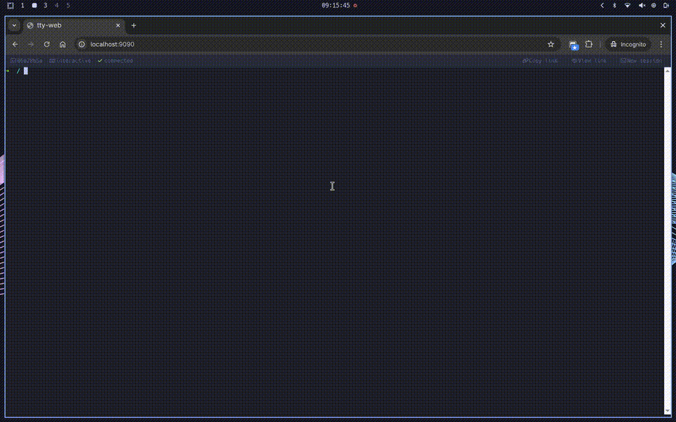

# tty-web

Web-based terminal emulator. Opens a real PTY in the browser over WebSocket.



## Features

- Real PTY with full job control, signals, and terminal capabilities
- Persistent sessions — reconnect without losing state
- Scrollback replay (64 KB buffer)
- Session sharing — multiple clients on one session
- View mode — read-only observers
- Lightweight binary WebSocket protocol
- Single static binary (frontend embedded via `rust-embed`)
- Multi-arch Docker images (`amd64` / `arm64`)

## Quick start

```bash
tty-web --address 127.0.0.1 --port 9090 --shell /bin/zsh
```

Or with Docker:

```bash
docker run --rm -p 9090:9090 ghcr.io/alviner/tty-web:latest
```

## Documentation

Full documentation is available at **[alviner.github.io/tty-web](https://alviner.github.io/tty-web)**.

## Build

```bash
make build     # debug
make release   # release
make docker    # docker image
```

## License

[MIT](LICENSE)
