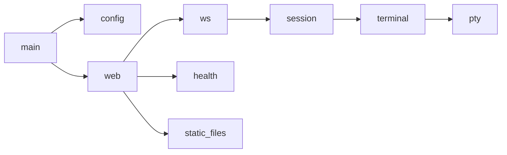

# Development

## Build

```bash
make build     # debug build
make release   # release build (LTO + strip, musl target)
make docker    # build Docker image
```

All available Make targets:

| Target | Description |
|--------|-------------|
| `build` | Debug build via `cargo build` |
| `run` | Run the binary via `cargo run` |
| `release` | Release build with LTO and symbol stripping |
| `clean` | `cargo clean` |
| `fmt` | Format code with `cargo fmt` |
| `lint` | Lint with `cargo clippy -- -D warnings` |
| `check` | `cargo check` |
| `docker` | Build release binary and Docker image |
| `docs` | Build mdbook + cargo doc into `docs/book/` |
| `docs-serve` | Serve docs locally with live reload |

## Architecture

The codebase is split into focused modules:



Each module has doc-comments describing its responsibilities — see the
[API Reference](./api-reference.md) for details.
