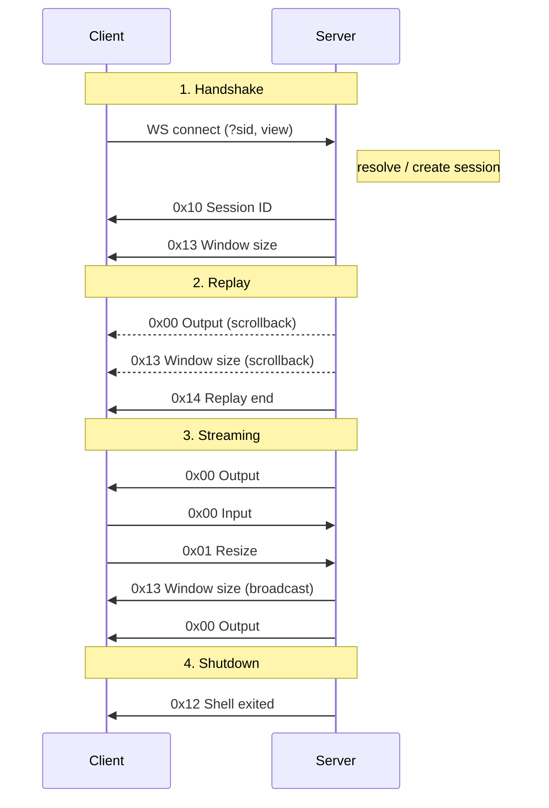

# Wire Protocol

All WebSocket messages are **binary frames**. The first byte is the command,
the rest is the payload.

## Commands

| Direction | Cmd | Payload | Description |
|-----------|-----|---------|-------------|
| client → server | `0x00` | raw bytes | Terminal input |
| client → server | `0x01` | rows(u16 BE) + cols(u16 BE) | Resize |
| server → client | `0x00` | raw bytes | Terminal output |
| server → client | `0x10` | UUID string | Session ID |
| server → client | `0x12` | — | Shell exited |
| server → client | `0x13` | rows(u16 BE) + cols(u16 BE) | Window size |
| server → client | `0x14` | — | Replay end |

## Close codes

| Code | Meaning |
|------|---------|
| `4404` | Session not found (invalid or expired `sid`) |

## Handshake sequence

1. The client opens a WebSocket to `/ws` with an optional `sid` query parameter
   and an optional `view` flag.
2. The server resolves an existing session or creates a new one. If `sid` is
   provided but not found, the connection is closed with code **4404**.
3. The server sends `0x10` with the session UUID. The client enters replay
   mode (input suppressed, terminal reset).
4. The server sends `0x13` with the current PTY window size. View-mode clients
   use this to match their terminal dimensions to the interactive session
   **before** scrollback replay.
5. The server replays the scrollback event log as a sequence of `0x00` (output)
   and `0x13` (window size) frames — one per stored event. The subscription
   is established atomically so no messages are lost between the replay and
   live streaming.
6. The server sends `0x14` (replay end). The client exits replay mode, shows
   the cursor, and sends its initial resize.
7. The main loop begins: output is forwarded as `0x00` frames, input and resize
   commands are read from the client. In view mode, client input is ignored.
8. When an interactive client sends a resize (`0x01`), the server updates the
   PTY and broadcasts `0x13` to all connected clients.
9. When the shell process exits, the server sends `0x12` and the connection
   closes.
